# API Scanner Terminal UI Prototypes

A collection of 14 distinct terminal user interface (TUI) prototypes for a recurring API scanner. These examples demonstrate different ways to visualize active scanning states and passive waiting states in the terminal using Python's `rich` library.

## 🚀 Features

- **Solarized Light Optimized**: All themes are tuned for light backgrounds (cream/white), with dark text and high-contrast accents.
- **Active/Passive States**: Distinct visual indicators for when the tool is scanning vs. waiting.
- **Mac Notifications**: Native macOS notifications (via `osascript`) when a scan completes or finds issues.
- **Realistic Simulation**: A shared `scanner_sim.py` module provides fake API endpoint results with jitter, response times, and random failures.
- **Demo Mode**: Accelerated timing (15s scan / 30s wait) by default for quick evaluation. Use `--real-timing` for production intervals (1 min / 5 min).

## 🛠 Setup

This project uses a Python virtual environment to manage dependencies.

```bash
# Clone or navigate to the directory
cd "terminal-ui"

# Activate the virtual environment
source venv/bin/activate
```

If you need to reinstall dependencies:
```bash
pip install -r requirements.txt
```

## 🖥 Terminal UI Options

### 1. Minimal Elegant (`example_minimal.py`)
A clean, compact single-panel dashboard with a simple progress bar and live log. Ideal for a minimal footprint.

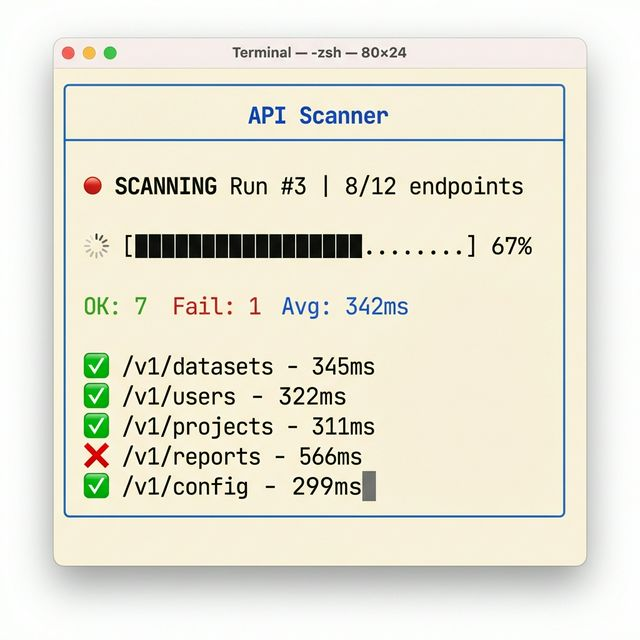

### 2. Full Panel Dashboard (`example_panels.py`)
A multi-pane layout using Rich's Layout system. Includes a header, footer, live scan feed, history sidebar, and status panel.

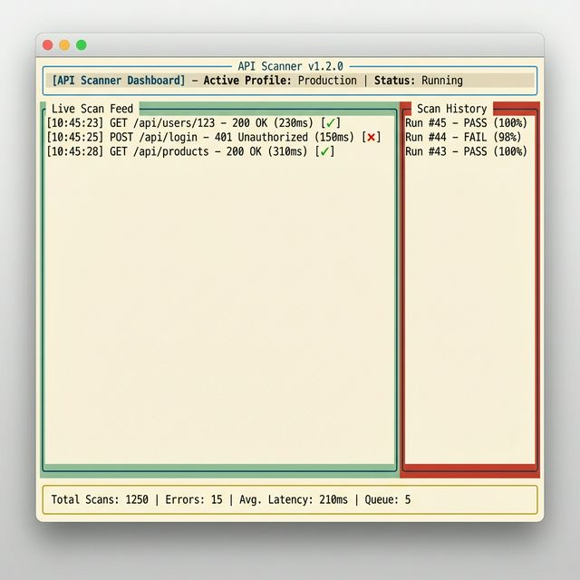

### 3. Retro Cyberpunk (`example_cyber.py`)
A neon-accented UI with ASCII art and a "Matrix-style" background animation during idle states.

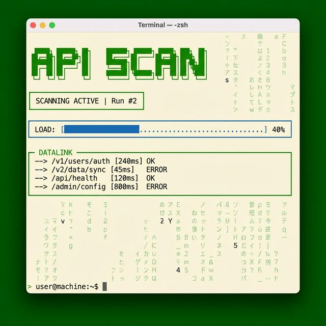

### 4. Cylon Eye Scanner (`example_cylon.py`)
Features an iconic red "eye" sweep that ping-pongs left-to-right (like a Cylon Raider) during scans, and a slow breathing pulse when idle.

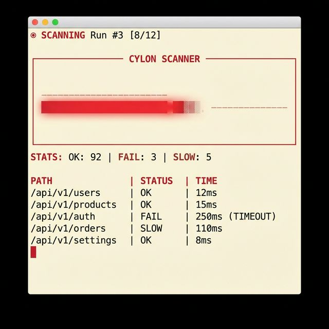

### 5. Metrics Dashboard (`example_panels_metrics.py`)
A metrics-dense dashboard featuring sparkline latency charts, color-coded gauge bars, and a clean light layout.

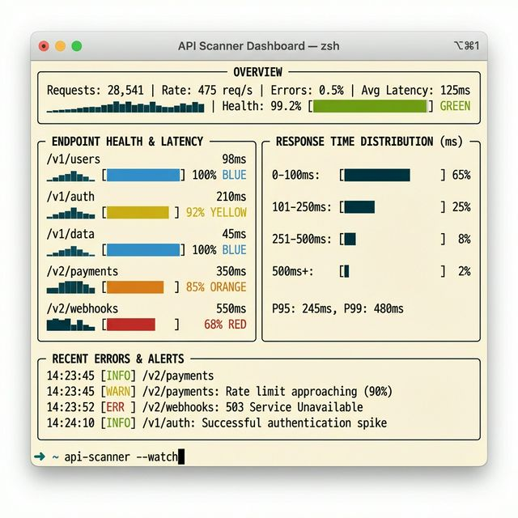

### 6. Compact Horizontal (`example_panels_compact.py`)
A space-efficient 3-column card layout that shows many endpoints simultaneously without vertical scrolling.

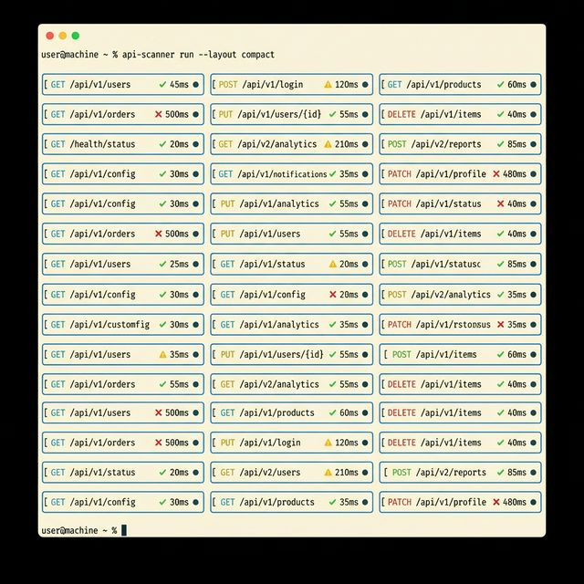

### 7. Timeline View (`example_panels_timeline.py`)
Visualizes the scan as a vertical timeline of connected nodes, showing exactly when each endpoint was hit relative to others.

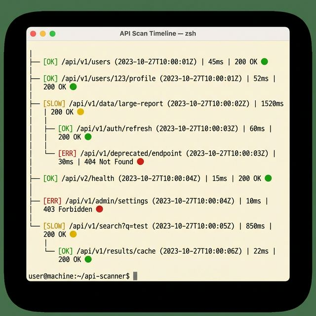

### 8. Grid Matrix (`example_grid.py`)
A dense, high-information grid view where each endpoint is a status cell. Cells highlight and pulse during scanning.

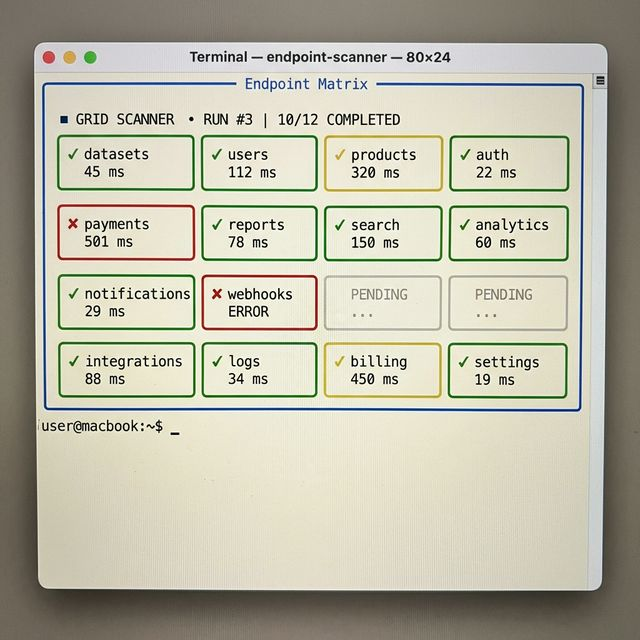

### 9. Deep Space Radar (`example_radar.py`)
A circular radar sweep animation that "pings" endpoints as the beam rotates. Features a novel ASCII-art style sonar.

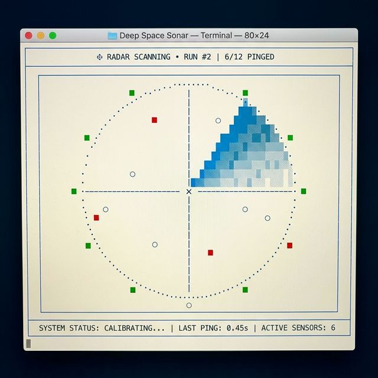

### 10. Tactical HUD (`example_hud.py`)
A futuristic Starship-style Head-Up Display with bracketed status indicators, double-line borders, and cyan tactical accents.

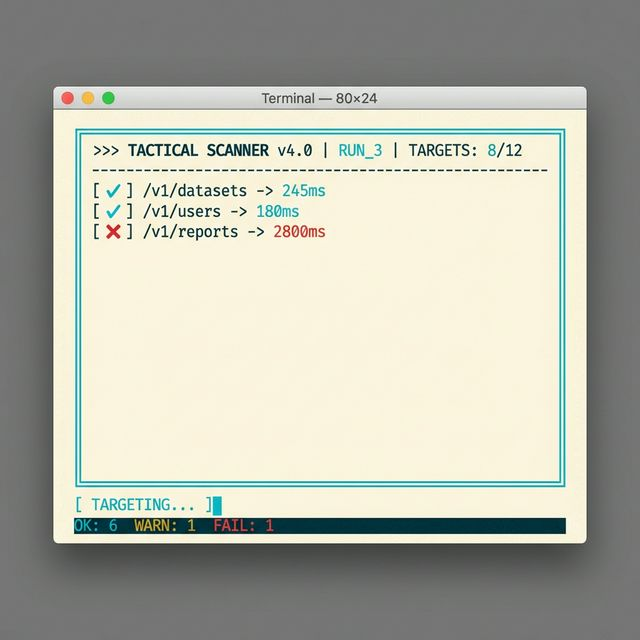

### 11. Wave Spectrum Analyzer (`example_wave.py`)
Audio equalizer-style visualization with animated vertical bars representing response times. Bars pulse and change height based on endpoint status.

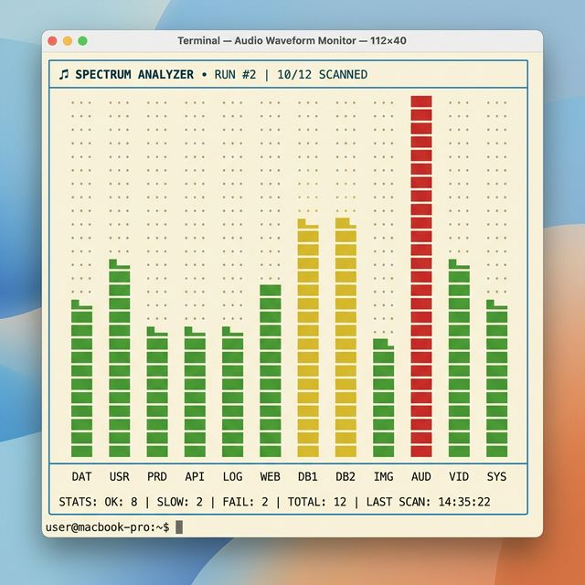

### 12. Metro/Subway Map (`example_metro.py`)
Transit network visualization with API endpoints as stations on colored metro lines. An animated train travels between stations during scanning.

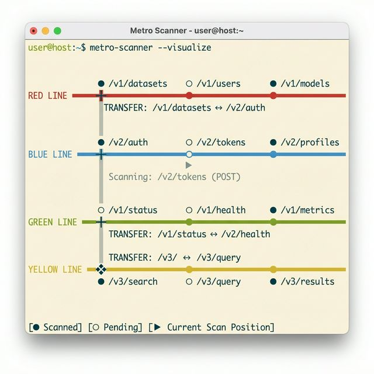

### 13. DNA Helix Scanner (`example_helix.py`)
Rotating double-helix visualization with endpoints distributed along spiral strands. Features 3D perspective with depth-based rendering.

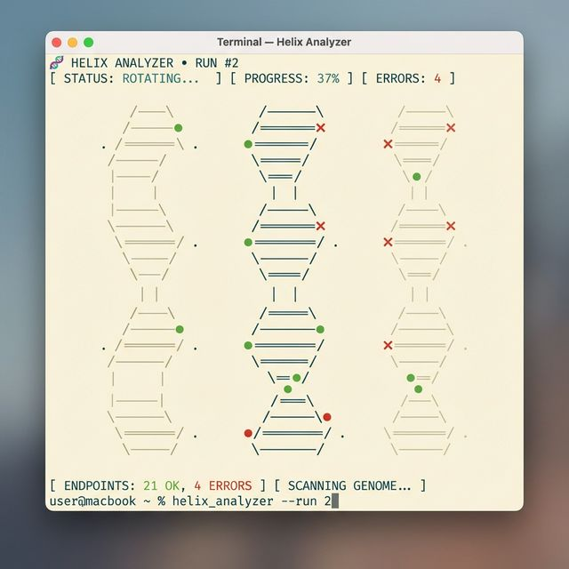

### 14. Circuit Board Tracer (`example_circuit.py`)
Electronics-themed display showing endpoints as IC chips on a circuit board with signal traces and blinking power LEDs.

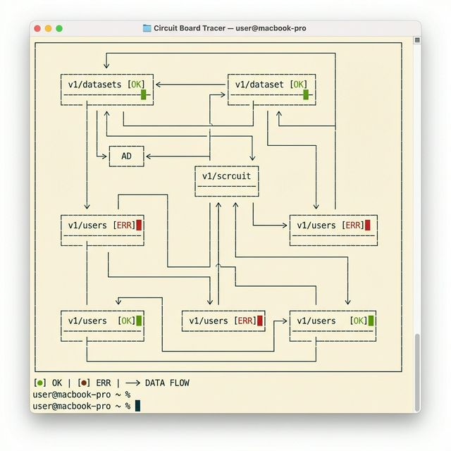

## ⚙️ Configuration

All scripts support the following command-line argument:
- `--real-timing`: Use the production intervals (1 minute scan duration, 5 minute wait between scans) instead of the accelerated demo timing.

## 📂 Project Structure

- `example_*.py`: Individual UI prototype implementations.
- `scanner_sim.py`: Shared simulation logic and notification utility.
- `requirements.txt`: Python dependencies (`rich`, `httpx`).
- `venv/`: Local Python virtual environment.
